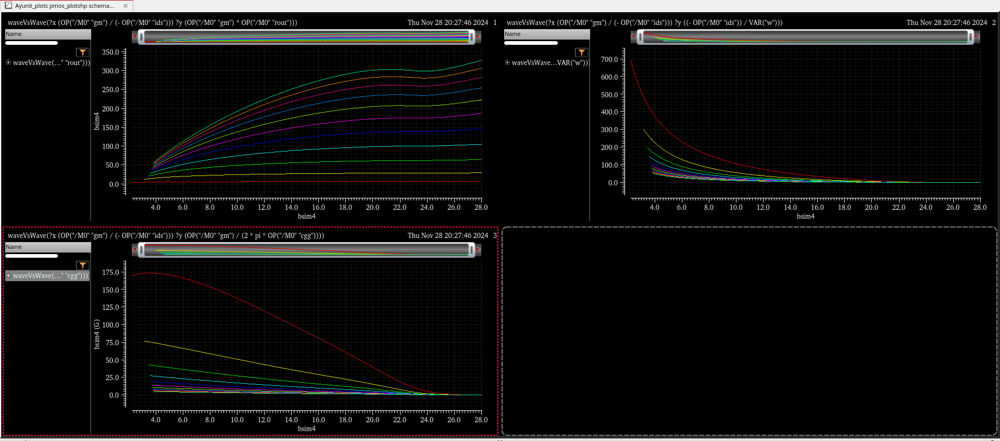
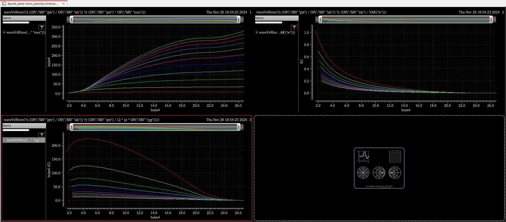
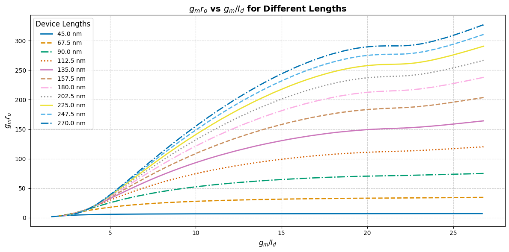
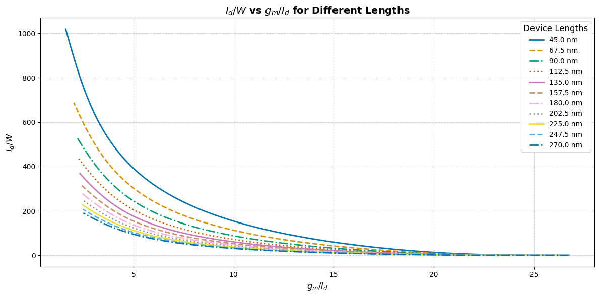
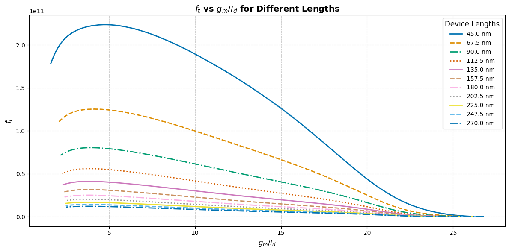
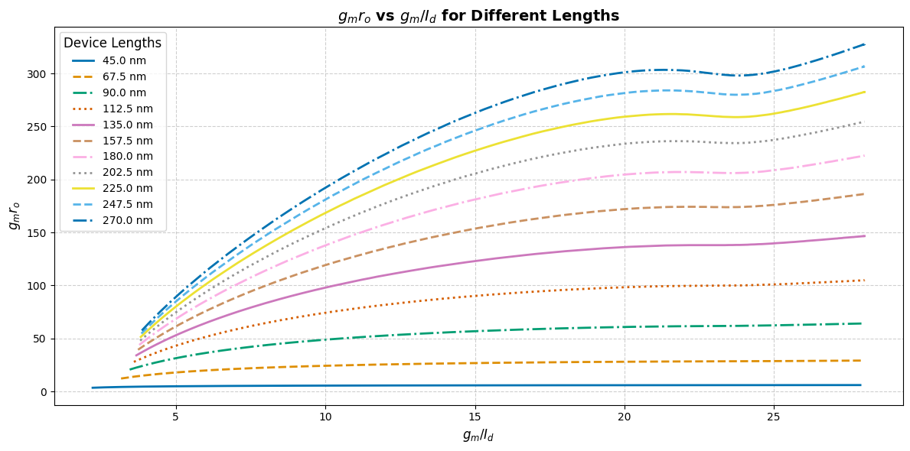
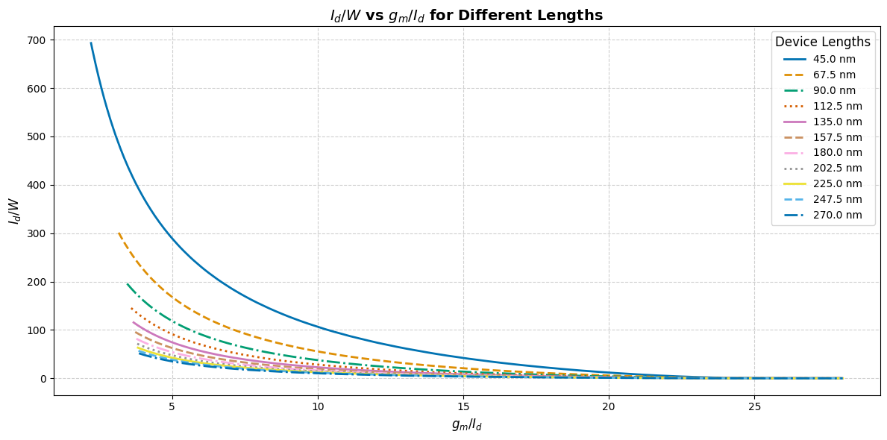
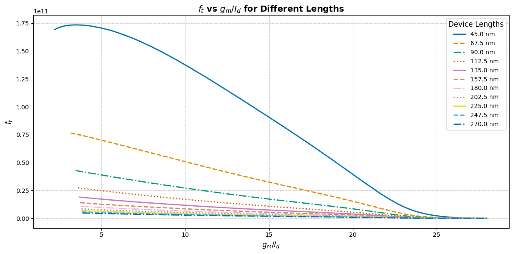

# **VL502: Analog IC Design, 2024-25 Final Project: LDO Design Using Techplots (gpdk 45nm)**

Design and optimization of Low-Dropout Regulators (LDOs) using technology plotting (techplots) methods in contrast to traditional square-law models. This project utilizes the **gpdk 45nm technology node**, leveraging Cadence tools and Python scripting for analysis and visualization.

---

## **Why Techplots Over Square-Law Models?**

### The Challenge with Square-Law Models  
Square-law models, though widely used in analog circuit design, are approximations that fail to capture short-channel effects, velocity saturation, and other high-field phenomena critical in deep-submicron processes like 45nm. This often leads to discrepancies between design intent and silicon performance.

### Why Techplots?  
Techplots bridge this gap by deriving model-independent transistor parameters directly from simulation data. This approach enables more accurate predictions of performance metrics such as:

 <details> 
    <Summary>Transconductance efficiency (g<sub>m</sub>/I<sub>d</sub>)
    </summary>

### What is (g<sub>m</sub>/I<sub>d</sub>)?

 - (g<sub>m</sub>/I<sub>d</sub>) is a critical design metric in analog circuits known as transconductance efficiency. It measures how effectively the transistor converts current into gain (how much the current controls the voltage output).

  - High (g<sub>m</sub>/I<sub>d</sub>) values typically represent low power consumption for a given transconductance, which is crucial in low-power designs.
  ---

</details>

- Intrinsic gain (g<sub>m</sub>r<sub>o</sub>)
- Transition frequency (f<sub>t</sub>)

**Key Insight:** The inclusion of simulation-driven parameters enhances accuracy, especially for designs targeting high-speed and low-power applications.


## **Parameters and Technology Node**

- **Technology Node**: gpdk 45nm
- **MOSFET Types**: NMOS, PMOS
- **Channel Lengths (L)**: 11 values, ranging from 45nm to 270nm (increment of 12.5nm)  
- **Extracted Parameters**:
  - g<sub>m</sub>/I<sub>d</sub>: Transconductance efficiency
  - g<sub>m</sub>r<sub>o</sub>: Intrinsic gain
  - I<sub>d</sub>/W: Current density
  - f<sub>t</sub>: Transition frequency

---

## **📂 Repository Structure**

```plaintext
├── Master/
│   ├── NMOS_simulation.png
│   ├── PMOS_simulation.png
├── Data/
│   ├── NMOS/
│   │   ├── NMOS_data_ft.csv
│   │   ├── NMOS_data_gmro.csv
│   │   ├── NMOS_data_idw.csv
│   ├── PMOS/
│       ├── PMOS_data_ft.csv
│       ├── PMOS_data_gmro.csv
│       ├── PMOS_data_idw.csv
├── Scripts/
│   ├── techplot_analysis.py
│   ├── Techplot_Colab_Notebook.ipynb
├── Plots/
│   ├── NMOS/
│   │   ├── N_Id_upon_W.png
│   │   ├── N_ft.png
│   │   ├── N_gmro.png
│   ├── PMOS/
│       ├── P_Id_upon_W.png
│       ├── P_ft.png
│       ├── P_gmro.png
├── README.md
```

---

## **Simulation Results and Insights**

### Initial Cadence Outputs

  

  

- **Key Observations**:
  - The efficiency of \( g_m/I_d \) improves for specific channel lengths, indicating an optimal trade-off point between speed and power
  - Transition frequency (\( f_t \)) showcases a noticeable dependency on channel length, aligning with theoretical predictions of high-frequency performance.


## **Final Plots**

### NMOS Plots
- (g<sub>m</sub>/I<sub>d</sub>) vs. (g<sub>m</sub>r<sub>o</sub>)  
  

- (g<sub>m</sub>/I<sub>d</sub>) vs. (I<sub>d</sub>/W)  
  

- (g<sub>m</sub>/I<sub>d</sub>) vs. (f<sub>t</sub>)  
  

### PMOS Plots
- (g<sub>m</sub>/I<sub>d</sub>) vs. (g<sub>m</sub>r<sub>o</sub>) 
  

- (g<sub>m</sub>/I<sub>d</sub>) vs. (I<sub>d</sub>/W)    
  

- (g<sub>m</sub>/I<sub>d</sub>) vs. (f<sub>t</sub>)  
  

---

## **Data and Scripts**

- **Simulation Data**: csv files for NMOS and PMOS [here](Data/).  
- **Analysis Script**: Python script for techplot analysis can be found [here](Scripts/) or our [Colab Notebook](https://colab.research.google.com/drive/1RrQe48ugOh9o6v59a-_cJjSKxmBqI8V3?usp=sharing).

---

## **Our Team**

**Yerasi Manoj Reddy**  
**Email**: yerasimanojreddy@gmail.com  
**Eshwar Allampally**  
**Email**: eshwarsworkplace@gmail.com  
**Chandrashekar Jha**  
**Email**: csjha2000@gmail.com
